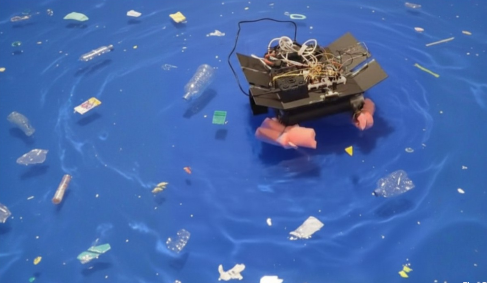
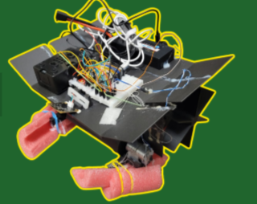
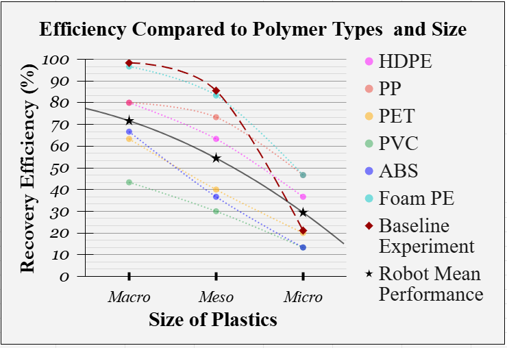
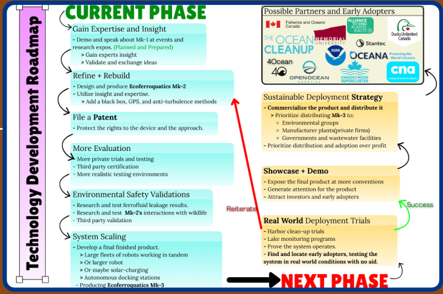

# ECOFERROQUATICS MK-1
AI-Powered Ferrofluid Robot for Selective Plastic Removal

 

## Overview
Ecoferroquatics Mk-1 is an autonomous aquatic robot designed to detect and remove plastic from water. The robot utilizes AI-based computer vision, combined with a custom ferrofluid and magnetic drum system, to selectively capture plastic pollutants. The goal is to create a smarter alternative to traditional cleanup methods, such as nets, skimmers, and filters.

## Problem
Current plastic cleanup methods are often non-selective. Nets, skimmers, and filters can clog quickly, disturb wildlife, and struggle to recover smaller plastic pollutants efficiently.
Essentially, current methods require too much manpower, kill animals and fail to heal the earth of the aquatic plastic pollutants effectively.

## Solution
My project uses computer vision to detect floating plastic in real time and guide an aquatic robot toward the target. A custom hydrophobic ferrofluid interacts with non-polar plastic surfaces, and a magnetic drum helps recover the adhered material. Ferrofluid is a suspension of magnetic nanoparticles in a carrier fluid, my ferrofluid uses cooking oil as a formula to take advantage of its non-polar properties.

## How It Works

### AI
- Detects plastic objects on the water surface in real time
- Uses onboard computer vision for navigation and targeting(Raspberry Pi and Arduino)

### Mechanical System & Architecture
- Floating robotic platform
- Rotating magnetic drum for recovery
- Double-decked system
- Paddle-based propulsion for silent, less disruptive movement

### Electronics
- Electronics stowed on upper deck high above water.
- Raspberry Pi 4B for vision and high-level control
- ESP32 for motor control
- 2 Cell Battery-powered mobile platform

### Ferrofluid Chemistry
- Custom oil-based ferrofluid containing magnetite particles
- Designed to interact with hydrophobic, non-polar plastic surfaces
- Magnetite, Stearic Acid, Oleic Acid, Cooking Oil

## Results
In controlled testing, ECOFERROQUATICS Mk-1:
- Recovered an average of 51.85% of plastics in trial conditions
- Recovered an average of 1.73 plastic pieces per minute
- Performed best with larger porous plastics
- Outperformed a manual baseline method on smaller particle sizes
- Successfully operated across multiple polymer and size classes

## Media

[Sample Video](https://www.youtube.com/watch?v=6Y_gKKuMHug)

[Explanation Video](https://www.youtube.com/watch?v=lcMyvF_FRY8)

## Challenges
- Buoyancy and balance required repeated tuning
- Glare and reflections affected vision performance; AI was a necessary addition.
## Limitations
- Real-world water conditions may reduce performance compared with controlled testing

## Future Work
- Expand testing into less controlled aquatic environments
- Further validate environmental safety and ferrofluid containment
- Swarm behaviour robotics
- Subsurface underwater construction
- 

## Tech Stack
- Python
- OpenCV
- TensorFlow Lite
- YOLOv8
- Raspberry Pi 4B
- C
- TB6612FNG (Motor Driver)
- ESP32
- Custom ferrofluid formulation
- Motor driver and aquatic propulsion system

## Repo Structure
- `media/` → photos and demo visuals
- `ai/` → AI and vision-related files
- `hardware/` → component info and diagrams
- `experiments/` → results, graphs, and testing information
- `docs/` → system overview and design notes
